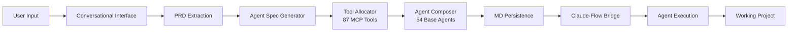

# Pantheon Developer Guide

## 🏗️ Architecture Overview

Pantheon implements a revolutionary approach to code generation through conversational AI and dynamic agent composition.

### Core Innovation: PRD → Custom MD → AI Agents



## 🔧 Key Components

### 1. Conversational Interface (`/gods/lib/conversational-interface.js`)
Manages the dialogue between user and gods:
- **Zeus Discovery**: Extract project vision and requirements
- **Apollo Design**: Gather UI/UX preferences
- **Prometheus Planning**: Define features and priorities

### 2. Agent Specification Generator (`/gods/lib/agent-spec-generator.js`)
Converts PRD into agent specifications:
```javascript
// Maps features to capabilities to agent types
FeatureExtraction → CapabilityMapping → AgentSelection
```

### 3. Tool Allocator (`/gods/lib/tool-allocator.js`)
Intelligently assigns from 87 MCP tools:
- Swarm coordination tools
- Neural processing tools
- Code generation tools
- Real-time communication tools
- Database and persistence tools

### 4. Agent Composer (`/gods/lib/agent-composer.js`)
Creates hybrid agents through composition strategies:
- **Merge**: Combine all capabilities
- **Overlay**: Base + additions
- **Hybrid**: Intelligent optimization
- **Extend**: Single base + extensions

### 5. MD Persistence Manager (`/gods/lib/md-persistence-manager.js`)
Saves custom agent configurations:
```
.claude/agents/projects/{project-id}/
├── zeus-orchestrator.md
├── hephaestus-developer.md
├── apollo-designer.md
└── ...
```

### 6. Claude-Flow Bridge (`/gods/lib/claude-flow-bridge.js`)
Spawns and manages AI agents:
- CLI-based integration
- Event streaming
- Progress monitoring
- Error handling

## 📦 Project Structure

```
pantheon/
├── gods/
│   ├── bin/              # CLI entry points
│   ├── lib/              # Core libraries
│   │   ├── commands/     # Command implementations
│   │   ├── gods/         # God personalities
│   │   └── *.js         # Core components
│   └── package.json
├── claude-flow/          # AI orchestration engine
└── docs/                # Documentation
```

## 🛠️ Development Setup

### Prerequisites
- Node.js 18+ 
- npm or yarn
- Claude-Flow installed

### Local Development
```bash
# Clone and install
git clone https://github.com/bacoco/pantheon.git
cd pantheon
npm install

# Install Claude-Flow
node install-claude-flow.js

# Link for development
npm link

# Test commands
/gods help
```

### Environment Variables
```bash
# Optional configuration
export PANTHEON_DEBUG=true          # Enable debug logging
export CLAUDE_FLOW_PATH=./custom    # Custom Claude-Flow location
```

## 🔌 Extending Pantheon

### Adding a New God

1. Create god personality in `/gods/lib/gods/`:
```javascript
// gods/lib/gods/mynewgod.js
export class MyNewGod extends BaseGod {
  constructor() {
    super({
      name: 'MyNewGod',
      emoji: '🆕',
      specialties: ['new-feature'],
      personality: 'Innovative and forward-thinking'
    });
  }

  async generateResponse(context, query) {
    // God-specific logic
  }
}
```

2. Register in god factory:
```javascript
// gods/lib/god-factory.js
import { MyNewGod } from './gods/mynewgod.js';

godImplementations.set('mynewgod', MyNewGod);
```

3. Add to agent spec generator for automatic summoning

### Adding New Tools

1. Update tool catalog in `tool-allocator.js`:
```javascript
this.toolCatalog = {
  myCategory: {
    'my_new_tool': { 
      description: 'Does something amazing',
      category: 'innovation' 
    }
  }
};
```

2. Map to capabilities:
```javascript
this.capabilityToToolMap = {
  'my-capability': ['my_new_tool', 'related_tool']
};
```

### Custom Composition Strategies

Add to `agent-composer.js`:
```javascript
this.compositionStrategies = {
  'my-strategy': this.myStrategy.bind(this)
};

async myStrategy(baseAgents, spec) {
  // Custom composition logic
}
```

## 🧪 Testing

### Unit Tests
```bash
npm test                    # Run all tests
npm test -- --watch        # Watch mode
npm test -- agent-spec     # Specific test
```

### Integration Tests
```bash
# Test full flow
npm run test:integration

# Test specific god
npm run test:god -- zeus
```

### Manual Testing
```bash
# Test with debug output
PANTHEON_DEBUG=true /gods init "test project"

# Test specific components
node test/manual/test-agent-generation.js
```

## 🔍 Debugging

### Enable Debug Mode
```bash
export PANTHEON_DEBUG=true
export NODE_ENV=development
```

### Common Issues

**Claude-Flow Not Found**
```bash
# Verify installation
ls ./claude-flow/bin/claude-flow

# Reinstall if needed
node install-claude-flow.js
```

**Agent Spawn Failures**
- Check Claude-Flow is running
- Verify MD files are generated
- Check process permissions

**Tool Allocation Issues**
- Verify tool exists in catalog
- Check capability mappings
- Review allocation limits

### Debugging Tools

```javascript
// Add to any component
this.emit('debug', { 
  component: 'AgentComposer',
  action: 'compose',
  data: composedAgent 
});
```

## 📊 Performance Optimization

### Agent Composition
- Cache frequently used base agents
- Limit tool allocation per agent type
- Use appropriate composition strategy

### MD Generation
- Batch file operations
- Use streaming for large files
- Implement lazy loading

### Claude-Flow Integration
- Reuse agent processes when possible
- Implement connection pooling
- Handle timeouts gracefully

## 🔐 Security Considerations

### Input Validation
- Sanitize user input in conversations
- Validate PRD extraction
- Limit agent capabilities appropriately

### File System
- Restrict file operations to project directories
- Validate MD file paths
- Implement permission checks

### Process Execution
- Sandbox agent execution
- Monitor resource usage
- Implement kill switches

## 🚀 Deployment

### Production Setup
```bash
# Build for production
npm run build

# Set production environment
export NODE_ENV=production

# Start with PM2
pm2 start ecosystem.config.js
```

### Docker Deployment
```dockerfile
FROM node:18-alpine
WORKDIR /app
COPY . .
RUN npm ci --production
RUN node install-claude-flow.js
CMD ["node", "gods/bin/pantheon-cli.js"]
```

### Scaling Considerations
- Implement job queuing for agent tasks
- Use Redis for session management
- Consider microservices for gods

## 📚 API Reference

### Core Classes

#### AgentSpecGenerator
```javascript
const generator = new AgentSpecGenerator();
const specs = await generator.generateSpecs(projectData);
```

#### ToolAllocator
```javascript
const allocator = new ToolAllocator();
const tools = await allocator.allocateTools(agentSpec);
```

#### AgentComposer
```javascript
const composer = new AgentComposer(claudeFlowPath);
const agent = await composer.compose(spec);
```

#### MDPersistenceManager
```javascript
const persistence = new MDPersistenceManager(options);
const mdPath = await persistence.saveAgentMD(agentData);
```

### Events

All components emit events for monitoring:
```javascript
component.on('error', (err) => console.error(err));
component.on('progress', (data) => console.log(data));
component.on('complete', (result) => console.log(result));
```

## 🤝 Contributing

### Code Style
- ES6+ modules
- Async/await over promises
- Clear error messages
- Comprehensive JSDoc

### Pull Request Process
1. Fork and create feature branch
2. Add tests for new functionality
3. Update documentation
4. Submit PR with clear description

### Development Philosophy
- Conversational first
- Real AI agents, not templates
- Extensible architecture
- User empowerment

---

*Building the future of software development, one conversation at a time.* 🏛️